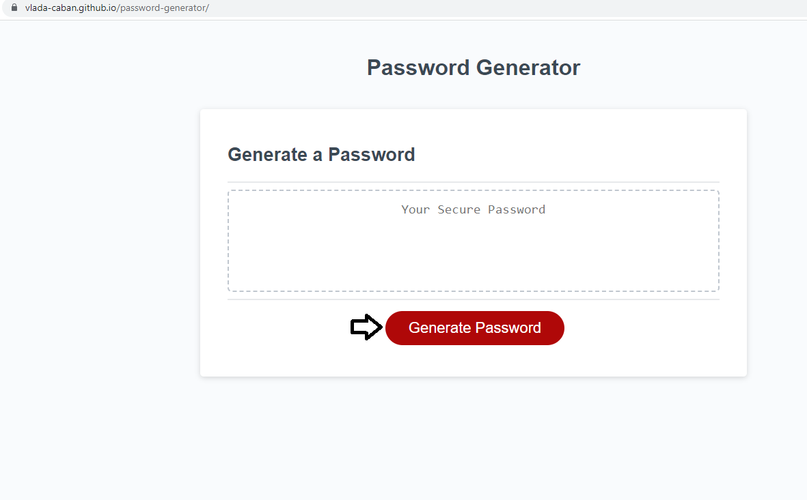
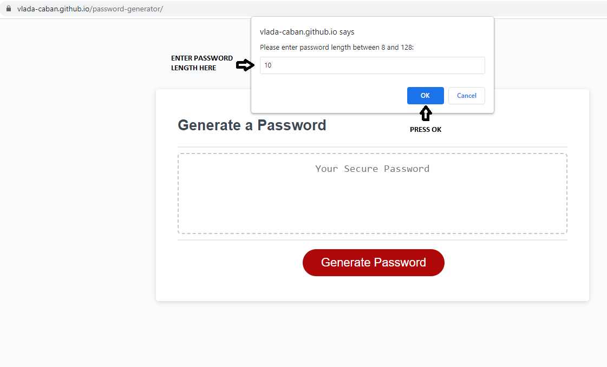
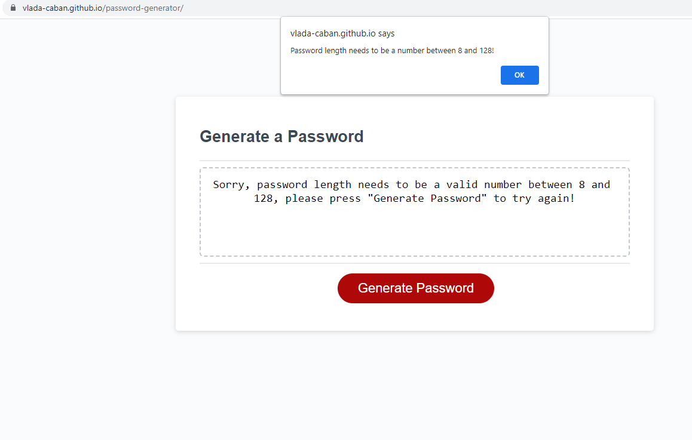
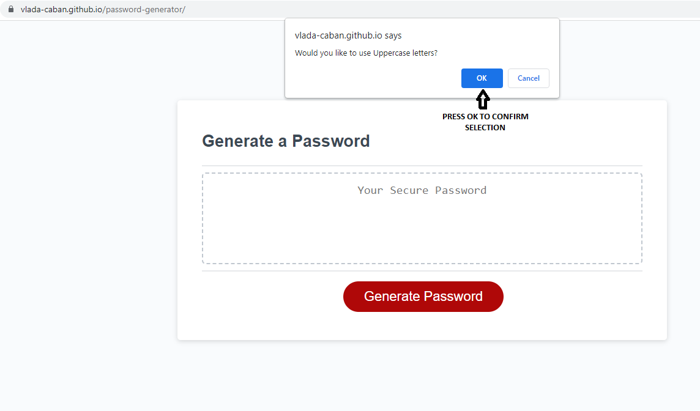
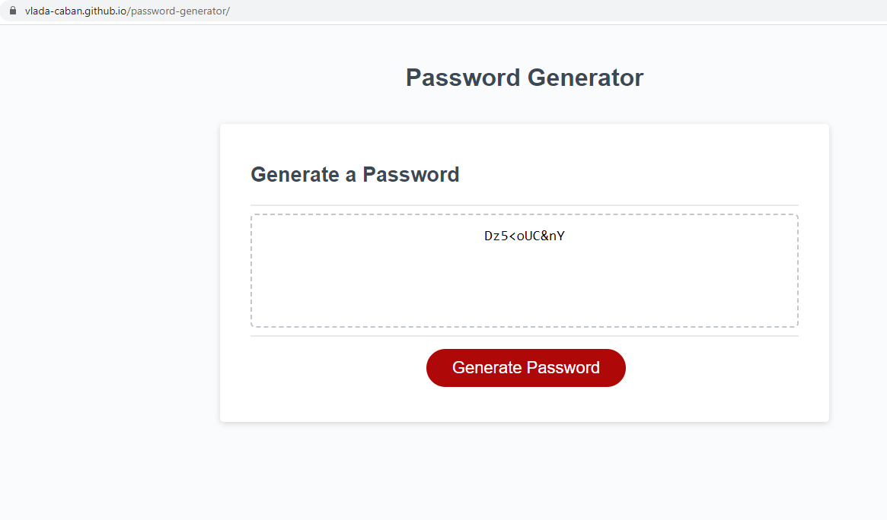

# Password Generator

## Description

The goal of this project was to create an application that enables users to generate random passwords based on criteria that they’ve selected. This web application runs in the browser and features dynamically updated HTML and CSS powered by JavaScript code.

- When user clicks the button to generate a password, they presented with a series of prompts for password criteria.
- When prompted for the length of the password, they can input a length of at least 8 characters and no more than 128 characters.
- Application checks if valid number between 8 and 128 was entered and alerts user if input doesn't match the criteria to try again. 
- User then confirms whether or not to include lowercase, uppercase, numeric, and/or special characters.
- User required to select at least one type of characters and if they don't meet the criteria, app alerts the user and offers to try again.  
- To ensure at least on of each characters would be present in the password, as user confirms criteria, random character from that set is being added to the password. 
- When the password is generated, it is displayed on the page inside of the text box.

## Usage

Web application is located at: https://vlada-caban.github.io/password-generator/

To generate password user needs to click "Generate Password" button.

After user clicks "Generate Password" button, pop up window prompts the user to enter desired password length between 8 and 128. 

If user inputs invalid length outside of required parameters or inputs not a number, page will alert the user and they can try again by first, dismissing alert by clicking "OK" and then pressing "Generate Password" button again to enter a valid password length.

After valid password length is entered, user will get series of confirmation windows asking to confirm the characters to be used for the password. At least one set of characters needs to be selected.

Once character sets selections are confirmed, password will be generated and displayed in the text box.

User can continue to generate more passwords with different criteria by pressing "Generate Password" button again. 

## Credits

Base code developed and provided by Columbia Coding Bootcamp.

## License

Please refer to the LICENSE in the repo.